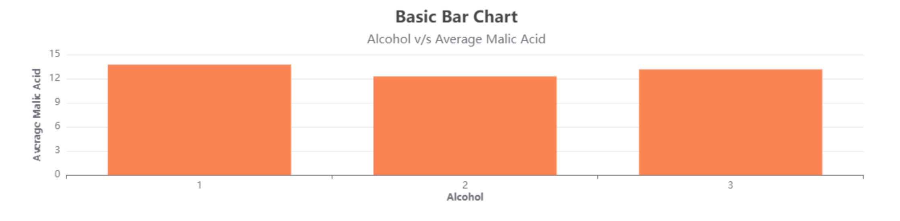

# TrishnaUI

## Contents

1. **[Project Title & description](#data-visualization)**
2. **[Technologies Used](#technologies-used)**
3. **[Libraries used](#libraries-used)**
4. **[Project Snapshots](#project-snapshots)**
5. **[Local Setup and running in Local](#local-setup-and-running-in-local)**

## 1. Data Visualization

- The data-visualization project aims to show to relation between two properties for a specific wine, plotted using graphical representaion - bar and scatter charts.

## 2. Technologies Used

- The technology used is React.js, a javascript library used to create fast, component-based web applications.

## 3. Libraries used

- yarn : for cration of react app and installing dependencies.
- echarts-for-react : for plotting graphs and charts from given data.

## 4. Project Snapshots

Following are some snapshots of the project

#### Bar Chart Desktop view

#### Bar Chart Mobile view

#### Scatter Chart Desktop view

#### Scattter Chart Mobile view

## 5. Local setup and running in local

- The app is made in React.js with additional dependencies such as echarts-for-react.
  Steps to run the app at your local machine

1. Run the command on CLI/command prompt to clone the repo on your local machine in the directory of your choice
   `https://github.com/Hnh013/data-visualization.git`
2. Take the latest pull by typing following command on CLI/command prompt
   `git pull origin main`
3. Run the command to install all the required dependencies for the project to run it locally  
   `yarn install`
4. Run the project in local environment by running the following command  
   `yarn start`

[Back To Top](#top)
